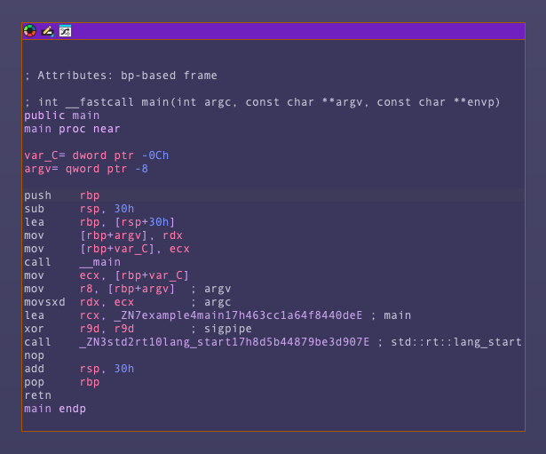
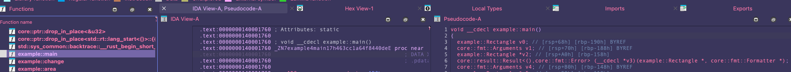

# Reversing Notes

I opened rust_101 example in IDA.

There is a difference in the name of the function as it shows in the function view and the assembly (IDA View). In the the disassembly it is mangled.

